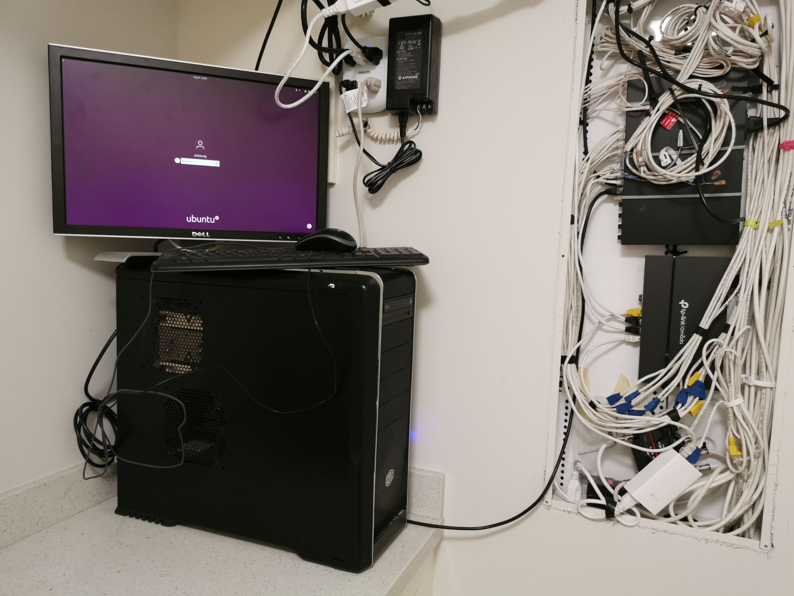

# Home Server
Click here to see my documentation of the home server journey:  
[Home Server Documentation](https://docs.alvincheung.ca/)

I transformed my old computer into a home server and have implemented the following:    
- Personal Dropbox-like service called Nextclound
- 24/7 Gamer servers
- Home coding server
- Personal website hosting
- Nginx proxy server to provide subdomains
- Personal project web hosting
